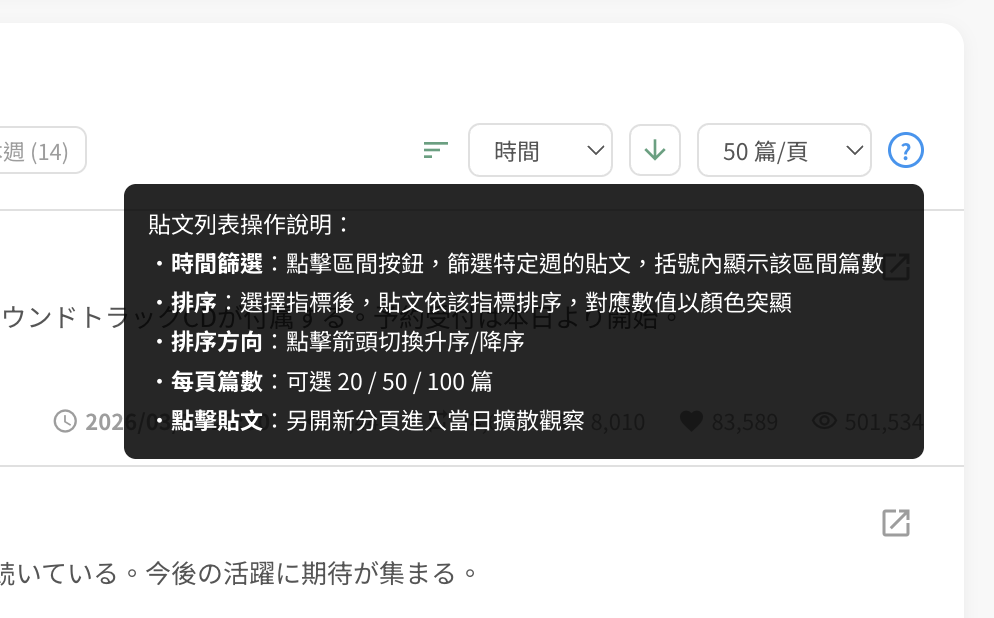
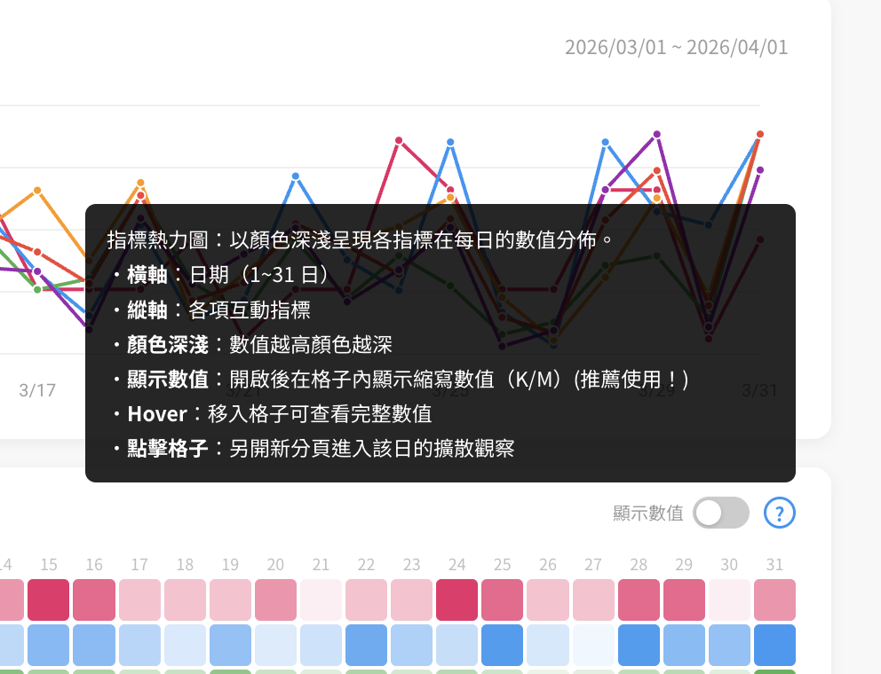
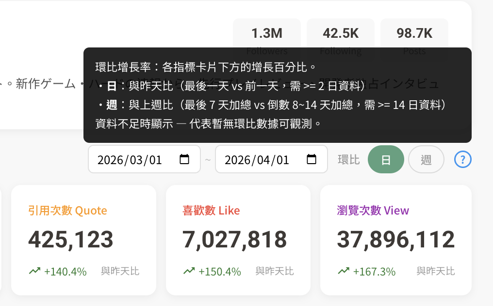

# KOL Account - 社群頻道分析系統

社群 KOL（Key Opinion Leader）帳號分析儀表板原型，純前端 HTML + JS + CSS 實作，無需建置工具。

**Demo**: [GitHub Pages](https://neilchang-product.github.io/kol-account/kol-list.html)

---

## 頁面結構

| 頁面 | 檔案 | 說明 |
|------|------|------|
| 帳號清單 | `kol-list.html` | 所有追蹤帳號的列表、搜尋、新增帳號 |
| 帳號分析 | `kol-account.html` | 單一帳號的完整分析儀表板 |
| 擴散觀察 | `kol-spread.html` | 單日 24 小時擴散趨勢分析 |
| 貼文分析 | `kol-post.html` | 單篇貼文的互動分析（框架） |

### 帳號清單 (kol-list.html)

- 帳號列表含名稱、平台、粉絲數、最後分析時間
- 搜尋功能（帳號名稱、ID、URL、描述）
- 說明提示：搜尋→選取→確認的探勘流程與預估時間
- 新增帳號 Modal（兩步驟流程）：
  - **Step 1 搜尋**：輸入 URL 或帳號名稱，自動辨識平台（X/IG/YT/Threads/TikTok/FB）
  - **Step 2 確認**：顯示搜尋結果列表（可能多筆），包含帳號名稱、ID、平台、描述、followers/posts 等資訊，點擊選取後新增
  - 預設展示：搜尋 "beauty" 會顯示 3 個 X 平台美妝相關帳號供選擇
- 分析中帳號顯示 spinner + 進度百分比

### 帳號分析 (kol-account.html)

- **帳號資訊**：頭像、名稱、ID、創建日期、Followers/Following/Posts
- **數據指標卡片**（6 個）：貼文數、回覆、轉發、引用、喜歡、瀏覽
  - 即時環比增長率（從 chart 數據計算，非寫死）
  - 支援日/週環比切換，顯示「與昨天比」或「與上週比」
  - 可點擊 toggle 指標顯示/隱藏
- **指標趨勢圖**（Canvas）
  - 多指標折線圖，各指標獨立正規化
  - 支援日/週環比切換
  - Hover tooltip 顯示每日各指標數值 + 垂直虛線
  - 點擊某天可過濾貼文列表
- **指標熱力圖**（31 天 × 6 指標）
  - 顏色深淺 = 數值大小
  - Hover 放大 1.3 倍 + tooltip
  - 「顯示數值」switch 開關（K/M 縮寫）
  - 點擊格子另開新分頁進入擴散觀察
- **相關貼文列表**
  - 時間區間篩選（全區間/近1個月/各週），顯示各區間篇數
  - 排序（時間/喜歡/回覆/轉發/引用/瀏覽）+ 升降序
  - 排序中的指標在貼文 meta 中以對應顏色 highlight
  - 分頁（20/50/100 篇可切換）
  - 點擊貼文另開新分頁進入擴散觀察
  - 每篇貼文右上角有原始連結按鈕，可另開至社群平台原始貼文

### 擴散觀察 (kol-spread.html)

- **簡化版帳號資訊**：頭像、名稱、ID、Followers/Following/Posts
- **標題**：當日擴散觀察 + 日期 + 貼文數
- **指標卡片**（5 個）：回覆、轉發、引用、喜歡、瀏覽（當日匯總）
  - 可點擊 toggle 指標，連動趨勢圖和熱力圖
- **指標趨勢圖**（Canvas，X 軸 0~23 小時）
  - 基於真實 hourly 擴散數據（logistic sigmoid 曲線模擬）
- **指標熱力圖**（24 小時 × 6 指標）
  - 「顯示數值」switch 開關
- **當日貼文列表**
  - 可點擊選取單篇/多篇貼文（toggle）
  - 選取後指標卡片、趨勢圖、熱力圖全部連動只計算選中貼文
  - 取消全部選取即恢復當日全部匯總
- **URL 參數**
  - `?id=@famitsu&date=2026/03/15` → 顯示該日所有貼文
  - `?id=@famitsu&date=2026/03/15&pid=f001` → 自動 highlight 指定貼文

---

## 資料架構（三層分離）

模擬 API 端的資料分層設計，以 `pid` 關聯：

| 層 | 檔案 | 大小 | 對應儲存 | 載入時機 |
|----|------|------|----------|----------|
| 帳號總覽 | `data.json` | ~15 KB | — | 頁面載入 |
| 1. 貼文主體 | `data-posts.json` | ~78 KB | ES (Elasticsearch) | 頁面載入 |
| 2. 日級指標 | `data-posts-daily.json` | ~45 KB | 時序 DB | 頁面載入 |
| 3. 小時級指標 | `data-posts-hourly.json` | ~643 KB | 時序 DB | Lazy load（擴散觀察頁） |

### 資料欄位

**data-posts.json**（貼文主體）
```json
{ "pid": "f001", "title": "【速報】...", "text": "本日の発表によると...", "time": "2026/03/15 11:00", "hashtags": ["#tag"], "post_url": "https://x.com/famitsu/status/1936422013297021757" }
```

**data-posts-daily.json**（日級指標，pid 為 key）
```json
{ "f001": { "reply": 945, "repost": 8900, "quote": 1560, "like": 62000, "view": 210000 } }
```

**data-posts-hourly.json**（小時級擴散，pid 為 key，發文後 0~23 小時累積值）
```json
{ "f001": { "like": [500, 2800, 8500, ...], "view": [...], "repost": [...], "reply": [...], "quote": [...] } }
```

---

## 模擬資料

| 帳號 | 類型 | 貼文數 | 每日篇數 |
|------|------|--------|----------|
| @famitsu | 遊戲媒體 | 147 篇 | 3~7 篇/日 |
| @kubotajirusi1 | 漫畫家 | 115 篇 | 2~5 篇/日 |
| @avenger_rs1 | 模型製作 | 107 篇 | 2~5 篇/日 |
| @beautyguru_d | （分析中 66%） | — | — |
| @skincare_prof | （分析中 33%） | — | — |
| @techreview_tw | （分析中 12%） | — | — |

- 時間範圍：2026/03/01 ~ 2026/03/31
- 發文時段：07:00 ~ 23:00 隨機分佈
- Hourly 擴散曲線：logistic sigmoid 模擬真實衰減

---

## 技術特點

- 純 HTML + JS + CSS，單檔案架構，無框架依賴
- Canvas 繪製多指標趨勢圖（各指標獨立正規化，避免數量級壓扁）
- CSS Grid 熱力圖（支援 hover 放大 + tooltip + 數值疊加）
- 三層資料分離設計，對應不同儲存引擎（ES + 時序 DB）
- Lazy load hourly 資料，帳號頁不載入不需要的資料
- 響應式環比計算（從 chart 數據即時運算，非寫死假值）
- 環比增長率設計規格文件：[`spec-growth-rate.md`](spec-growth-rate.md)

---

## Change Log

### 2026-04-17 15:00

- **環比增長率規格定案** — 詳見 [`spec-growth-rate.md`](spec-growth-rate.md)
  - 日環比：最後一天 vs 前一天，需 >= 2 日資料
  - 週環比：最後 7 天加總 vs 倒數 8~14 天加總（滾動式），需 >= 14 日資料
  - 資料不足時顯示 `—`，代表暫無環比數據可觀測
  - 環比的「週」採滾動取法，與趨勢圖/貼文列表的固定切法定義不同
- **操作說明 info tooltip** — 三處新增藍色 `?` 圖示，hover 顯示操作說明
  - 環比切換旁：日/週環比的計算規則與資料需求
  - 指標熱力圖旁：橫縱軸定義、顏色深淺、顯示數值（推薦使用！）、點擊進入擴散觀察
  - 貼文列表排序旁：時間篩選、排序指標、升降序、每頁篇數、點擊貼文

  
  
  

### 2026-04-16 22:00

- **貼文原始連結** — 每篇貼文新增 `post_url` 欄位，列表右上角可另開至社群平台原始貼文
- **新增帳號兩步驟流程** — 搜尋 → 確認選擇（支援多筆結果），預設展示 beauty 搜尋範例

### 2026-04-16 18:00

- **排序指標 highlight** — 排序中的指標在貼文 meta 以對應顏色突顯
- **貼文標題與內文分離** — `title` + `text` 雙欄位，列表同時顯示
- **Profile 佈局調整** — 頭像跨兩行、desc 跨全寬、stats 縮減高度、區塊間距壓縮

### 2026-04-16 14:00

- **相關貼文列表分頁** — 20/50/100 篇可切換
- **時間篩選顯示篇數** — 各區間按鈕顯示 `(n)` 篇數統計
- **熱力圖/貼文列表另開新分頁** — 點擊改為 `window.open` 另開 kol-spread

### 2026-04-16 10:00

- **環比功能實作** — 日/週切換連動趨勢圖粒度與增長率計算（從 chart 即時運算）
- **頁面拆分** — 當日擴散觀察從 kol-account.html 獨立為 kol-spread.html
- **三層資料分離** — data-posts.json（貼文主體）、data-posts-daily.json（日級指標）、data-posts-hourly.json（小時級擴散）

---

## 已知限制與待辦事項

### 目前為展示用原型，以下功能尚未實作：

1. **新增帳號為示意功能** — 帳號清單頁的「新增帳號」Modal 僅展示 URL 解析與平台辨識的互動流程，送出後不會實際寫入資料。

2. **未支援響應式佈局（RWD）** — 本原型以桌面瀏覽器為主要展示環境，未針對手機或平板做響應式適配。行動裝置上會出現跑版情形，建議以桌面瀏覽器開啟。

3. **帳號三維度數據尚未規劃實作** — Followers、Following、Posts 這三個帳號維度的指標目前只有表達最後數據，尚未展示日、小時級的時序數據。其實還可以往下長出功能與分析。但考量展示範圍，本次版本暫不涵蓋此部分。(建議時序資料還是採集，之後會用上)
